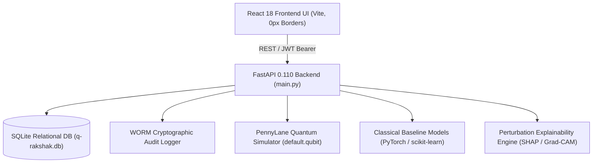

# Q-RAKSHAK: Master Documentation Index (`docs/INDEX.md`)

> **Smart India Hackathon (SIH) Problem Statement ID 26139**  
> *Platform:* Q-RAKSHAK Quantum Clinical Operating System  
> *Core Focus:* Hybrid Quantum Machine Learning Clinical Decision Support System (CDSS)  

---

## 📚 Complete Documentation Catalog

| Document | Category | Direct Link | Key Technical Highlights Covered |
| :--- | :--- | :--- | :--- |
| **README.md** | Getting Started | [**README.md**](../README.md) | Universal `main.py` entrypoint, PowerShell one-click scripts, Docker setup, and architecture summary |
| **Objective Compliance Report** | Research Audit | [**docs/OBJECTIVE_COMPLIANCE_REPORT.md**](OBJECTIVE_COMPLIANCE_REPORT.md) | Strict verification of Research Objectives OBJ-01 through OBJ-06 with code evidence and ablation benchmarks |
| **System Architecture (SRS)** | System Design | [**docs/SRS.md**](SRS.md) | IEEE 830-1998 / ISO/IEC/IEEE 29148 Software Requirements Specification |
| **REST API Specification** | API Reference | [**docs/API_SPEC.md**](API_SPEC.md) | Full OpenAPI 3.1.0 specification with JSON request/response schemas, RBAC guards, and status codes |
| **Database Schema** | Data Architecture | [**docs/DATABASE_SCHEMA.md**](DATABASE_SCHEMA.md) | Complete SQLite relational DDL, entity-relationship diagrams, indexes, and repository CRUD rules |
| **Quantum Algorithms** | Quantum Theory | [**docs/QUANTUM_ALGORITHMS.md**](QUANTUM_ALGORITHMS.md) | Hilbert spaces, Parameter-Shift rule, Strongly Entangling Ansatz, QSVM kernels, and QAS score |
| **Clinical & Operational Workflows** | Clinical SOPs | [**docs/CLINICAL_WORKFLOWS.md**](CLINICAL_WORKFLOWS.md) | Clinician diagnostic pipelines, Emergency QR card triage, WebRTC teleconsultations, and e-Prescriptions |
| **Compliance & Data Privacy** | Regulatory & Legal | [**docs/COMPLIANCE_DPDP_HIPAA.md**](COMPLIANCE_DPDP_HIPAA.md) | DPDP Act 2023 consent architecture, HIPAA 18 de-identification protocol, and WORM SHA-256 logs |
| **Mathematical Formula Sheet** | Mathematics & Physics | [**docs/FORMULA_SHEET.md**](FORMULA_SHEET.md) | Complete mathematical reference for angle embeddings, analytic gradients, MCC, ECE, and QAS |
| **Model Specification & Governance** | Machine Learning | [**docs/model.md**](model.md) | Named model families (`OncoPulse`, `CardioWave`, `NeuroSynapse`), fairness audits, and registry rules |
| **Skin Cancer QML Plan** | Vision QML | [**docs/SKIN_CANCER_QML_COMPLETE_IMPLEMENTATION.md**](SKIN_CANCER_QML_COMPLETE_IMPLEMENTATION.md) | 7-class HAM10000 dermoscopy, `QuantumDerma` family, ablation protocols, and Grad-CAM |
| **Pneumonia QML Plan** | Vision QML | [**docs/PNEUMONIA_QML_IMPLEMENTATION_PLAN.md**](PNEUMONIA_QML_IMPLEMENTATION_PLAN.md) | Binary chest X-ray classification, `QuantumPneu` hybrid VQC, and decision threshold calibration |
| **Skin Cancer Module Guide** | Module Guide | [**docs/skin_cancer.md**](skin_cancer.md) | Dataset audit, pipeline scripts, training commands, and evaluation metrics for HAM10000 |
| **Pneumonia Module Guide** | Module Guide | [**docs/pneumonia.md**](pneumonia.md) | Dataset audit, PneuVision backbone training, QuantumPneu VQC training, and evaluation |
| **Model Training Handbook** | Operational ML | [**docs/model_training.md**](model_training.md) | End-to-end PowerShell-safe training guide for both vision tasks with ablation sweeps |
| **QML Training Guide** | Developer Guide | [**docs/qml_training_guide.md**](qml_training_guide.md) | Practical step-by-step developer guide for quantum circuit tuning and benchmarking |
| **Quick Experiments Leaderboard** | Research Leaderboard | [**docs/quick_experiments_leaderboard.md**](quick_experiments_leaderboard.md) | Live experiment metrics table comparing Macro F1, Balanced Accuracy, and ROC-AUC |
| **Issue Audit & Resolution Log** | Quality Assurance | [**docs/ISSUES_RESOLVED.md**](ISSUES_RESOLVED.md) | Engineering resolution log for all algorithmic, database, security, and git configurations |
| **Step-by-Step Run Guide** | Operations | [**docs/run.md**](run.md) | Detailed launch runbook, troubleshooting, port conflicts, and persona walkthroughs |

---

## 🏗️ Architectural Topology

---

**© 2026 Q-RAKSHAK Core Architecture Group. SIH Problem Statement ID 26139.**
