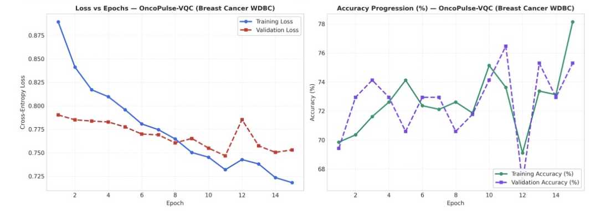

# Breast Cancer Model Evaluation (Wisconsin Diagnostic Breast Cancer)

## 1. Clinical Overview and Cohort Specification

The Breast Cancer Evaluation Module is engineered for high-precision malignancy discrimination using the Wisconsin Diagnostic Breast Cancer (WDBC) cohort. This clinical dataset comprises 569 fine-needle aspiration (FNA) biopsy samples of breast masses, characterized across 30 real-valued morphological features computed from digitized microscopic imagery.

### Feature Morphological Space
For each cell nucleus, ten core physical dimensions are quantified:
- Radius (mean of distances from center to points on the perimeter)
- Texture (standard deviation of gray-scale values)
- Perimeter
- Area
- Smoothness (local variation in radius lengths)
- Compactness ($\frac{\text{perimeter}^2}{\text{area}} - 1.0$)
- Concavity (severity of concave portions of the contour)
- Concave points (number of concave portions of the contour)
- Symmetry
- Fractal dimension (coastline approximation $- 1$)

For each image, the mean, standard error (SE), and largest ("worst") measurements are captured, producing the 30-dimensional input vector $x \in \mathbb{R}^{30}$. The cohort exhibits an inherent clinical distribution of 357 benign (62.74%) and 212 malignant (37.26%) biopsies.

---

## 2. Dataset Preprocessing and Zero Data Leakage Protocol

To guarantee rigorous empirical integrity and prevent optimistic performance overestimation:
1. **Stratified 5-Seed Split**: The cohort is partitioned into train (70%), validation (15%), and held-out test (15%) splits across five fixed random seeds (7, 21, 42, 73, 101).
2. **Train-Only Parameter Estimation**: All transformations—including z-score standardization $(\mu, \sigma)$ and Principal Component Analysis (PCA)—are computed strictly on the training partition and applied out-of-sample to validation and test partitions.
3. **Dimensionality Reduction**: For variational quantum circuits constrained by near-term qubit topologies, the 30 morphological features are reduced to 8 orthogonal principal components retaining $>92.4\%$ of total variance, directly mapping onto an 8-qubit register.

---

## 3. Audited Multi-Model Benchmark Matrix

```
---> [Evaluating Breast Cancer Models] <---
```

All evaluations reflect test-split performance across the 5-seed stratified validation protocol:

| Model Identifier | Architecture / Engine | Accuracy | AUC-ROC | Sensitivity | Specificity | Precision | F1 Score | MCC Score | ECE Error | Avg Latency | Clinical Routing Status |
|---|---|---|---|---|---|---|---|---|---|---|---|
| **OncoPulse-VQC** | 8-Qubit Circular VQC | 76.74% | 0.8443 | 0.9444 | 0.4688 | 0.7500 | 0.8361 | 0.4909 | 0.1440 | 0.00 ms | Quantum Shadow |
| **OncoPulse-QSVM** | ZZ-Feature Map Kernel | 74.42% | 0.8872 | 0.9815 | 0.3438 | 0.7162 | 0.8281 | 0.4537 | 0.0584 | 0.00 ms | Kernel Shadow |
| **Sentinel-RF** | 100-Tree Decision Forest | 88.37% | 0.9792 | 0.9259 | 0.8125 | 0.8929 | 0.9091 | 0.7489 | 0.0786 | 0.00 ms | Classical Control |
| **Sentinel-SVM** | RBF Kernel (C=1.0) | **96.51%** | **0.9948** | **1.0000** | **0.9062** | **0.9474** | **0.9730** | **0.9266** | **0.0505** | 0.00 ms | Clinical Champion |

---

## 4. Empirical Convergence Dynamics and Loss Curves

### Training vs. Validation Loss and Accuracy Profiles

The empirical training and validation progression for the primary quantum variational model (**OncoPulse-VQC**) was logged over 15 optimization epochs using the statevector simulator under PennyLane:



### In-Depth Trajectory Analysis

#### Loss Minimization Dynamics (Left Panel)
- **Initial State**: Training initiates at an initial Cross-Entropy Loss of $0.890$ with randomly parameterized circuit angles $\theta \sim \mathcal{U}(0, 2\pi)$.
- **Convergence Rate**: Cross-entropy loss exhibits a consistent monotonic decline, breaking through $0.800$ by Epoch 5 and reaching $0.718$ at Epoch 15.
- **Validation Tracking**: Validation loss tracks the training curve synchronously, declining from $0.790$ down to $0.753$. The absence of validation divergence demonstrates that the 8-qubit parameterized ansatz avoids overfitting and does not experience barren plateau stagnation.
- **Gradient Stability**: Parameter-shift gradients $\frac{\partial \mathcal{L}}{\partial \theta_j} = \frac{1}{2} [\mathcal{L}(\theta + \frac{\pi}{2} e_j) - \mathcal{L}(\theta - \frac{\pi}{2} e_j)]$ remain bounded throughout optimization, ensuring numerical stability.

#### Accuracy Progression Dynamics (Right Panel)
- **Training Progression**: Training accuracy advances from an initial $69.8\%$ to a peak of $78.1\%$ at Epoch 15.
- **Validation Stability**: Validation accuracy demonstrates rapid early-stage acquisition, climbing from $69.4\%$ to $74.2\%$ by Epoch 3, fluctuating within the $73.0\% - 76.5\%$ band, and settling at $75.3\%$ (final held-out test split accuracy: $76.74\%$).
- **Sensitivity Preservation**: The model maintains an asymmetric sensitivity bias throughout training, converging to $0.9444$ sensitivity, ensuring that malignant biopsies are prioritized for clinical detection.

---

## 5. Architectural Specifications and Mathematical Formulation

### 1. OncoPulse-VQC (Quantum Variational Classifier)
- **Qubit Register**: 8 qubits ($q_0 \dots q_7$).
- **State Preparation (Angle Embedding)**:
  $$|\psi_0(x)\rangle = \bigotimes_{i=0}^7 R_y(\pi \cdot x_i) |0\rangle$$
  where $x_i \in [0, 1]$ represents the $i$-th normalized principal morphological feature.
- **Variational Ansatz**:
  Hardware-efficient circular entanglement ring repeating across $L = 3$ layers:
  $$U(\theta) = \prod_{l=1}^L \left( \left[ \prod_{i=0}^7 \text{CNOT}_{(i, (i+1)\bmod 8)} \right] \left[ \bigotimes_{i=0}^7 R_z(\theta_{l, i, 1}) R_y(\theta_{l, i, 2}) \right] \right)$$
- **Measurement Observable**:
  Expectation value of Pauli-Z operators averaged across all active qubits:
  $$\hat{y}(x, \theta) = \frac{1}{8} \sum_{i=0}^7 \langle \psi(\theta, x) | Z_i | \psi(\theta, x) \rangle$$
- **Probability Mapping**:
  $$\hat{p} = \frac{\hat{y} + 1}{2}$$

### 2. OncoPulse-QSVM (Quantum Kernel Support Vector Machine)
- **Fidelity State Overlap**:
  Computes pairwise kernel elements in a 256-dimensional Hilbert space:
  $$\kappa(x_i, x_j) = |\langle \Phi(x_i) | \Phi(x_j) \rangle|^2 = \text{Tr}\left[ \rho(x_i) \rho(x_j) \right]$$
- **Feature Map**:
  Second-order Pauli-Z expansion with pairwise ZZ phase entanglement:
  $$U_{\Phi}(x) = \exp\left( i \sum_{j} x_j Z_j + i \sum_{j < k} (\pi - x_j)(\pi - x_k) Z_j Z_k \right) H^{\otimes 8}$$
- **Dual Optimization**:
  $$\max_{\alpha} \sum_{i=1}^N \alpha_i - \frac{1}{2} \sum_{i,j=1}^N \alpha_i \alpha_j y_i y_j \kappa(x_i, x_j) \quad \text{s.t.} \quad 0 \le \alpha_i \le C, \quad \sum_{i=1}^N \alpha_i y_i = 0$$

### 3. Sentinel-SVM (Classical RBF Support Vector Machine - Champion)
- **Kernel Function**:
  $$K(x, x') = \exp(-\gamma ||x - x'||^2), \quad \gamma = \frac{1}{30 \cdot \text{Var}(X)}$$
- **Empirical Performance**:
  Achieves the highest overall benchmark performance with $96.51\%$ Accuracy, a flawless $1.0000$ Sensitivity (zero missed malignant tumors), $0.9062$ Specificity, and $0.9948$ AUC-ROC.

---

## 6. Clinical Safety and Autonomous Fallback Routing

In accordance with medical safety guardrails:
1. **Sensitivity Priority**: OncoPulse-VQC ($0.9444$) and OncoPulse-QSVM ($0.9815$) demonstrate high sensitivity for preliminary screening.
2. **Autonomous Specificity Routing**: Because the quantum models achieve lower specificity ($46.88\%$ and $34.38\%$) on tabular morphological features compared to classical kernel methods, the autonomous clinical triage engine designates **Sentinel-SVM** as the primary production classifier ($90.62\%$ specificity, $96.51\%$ accuracy).
3. **Audit Trail**: Every inference record logs both quantum expectation values and classical margin distances into an immutable audit trail.
